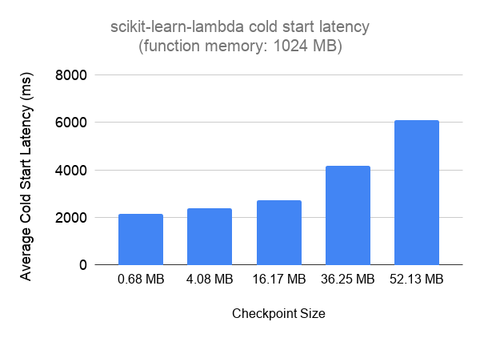
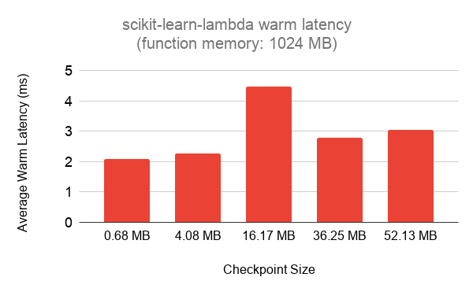

# scikit-learn-lambda

[](https://app.circleci.com/pipelines/github/model-zoo/scikit-learn-lambda) [](https://badge.fury.io/py/scikit-learn-lambda) [](https://opensource.org/licenses/Apache-2.0)

scikit-learn-lambda is a toolkit for deploying scikit-learn models for realtime inference on AWS Lambda.

## Why use scikit-learn-lambda?

* **Get started quickly** - `scikit-learn-lambda` handles the boilerplate code for you,
  simply drop in a `joblib` or `pickle` model file and deploy.
* **Cost efficient** - The equivalent architecture on [AWS
  SageMaker](https://aws.amazon.com/sagemaker/) will cost you ~$50 per endpoint per month.
  Deploying on AWS Lambda allows you to pay-per-request and not worry about
  the number of models you're deploying to production.
* **Built-in autoscaling** - Deploying on [Elastic Container
  Service](https://aws.amazon.com/ecs/) or [Kubernetes](https://kubernetes.io/)
  requires configuring and maintaining autoscaling groups. AWS Lambda abstracts
  this complexity away for you.

Read more in our blogpost: [Saving 95% on infrastructure costs using AWS Lambda for scikit-learn predictions](https://modelzoo.dev/blog/lambda.html).

## Overview

scikit-learn-lambda provides three components:

1) `scikit-learn-lambda`: A Python package that includes a handler for serving
   `scikit-learn` predictions via AWS Lambda, designed for use with API Gateway.
2) A repository of Lambda layers for various versions of Python (3.6 - 3.8)
   and `scikit-learn` (0.22+).
3) Example Serverless template configuration for deploying a model to an HTTP
   endpoint.

## Quickstart (Serverless)

You have two options for deploying a model with Serverless framework.

* Package your model as part of the deployment package upload to AWS Lambda.
This option will require your model file to be under ~50 MB, but achieve the best
cold-start latency.

* Store your model into Amazon S3 and load it from there on AWS Lambda
initialization. This option has no model size constraints.

#### Prerequisites

* [Install Serverless](https://www.serverless.com/framework/docs/providers/aws/guide/installation/)
* [Configure your AWS credentials](https://www.serverless.com/framework/docs/providers/aws/guide/credentials/)

#### Package your model with the code (~50 MB limit)

1) Copy your model joblib file to `scikit-learn-lambda/model.joblib`, the same
directory that `serverless.yaml` is in.

```
$ cp testdata/svm.joblib scikit-learn-lambda/model.joblib
```

2) Deploy your model with Serverless framework.

```
$ serverless deploy
```

3) Test the your endpoint with some example data:

```
$ curl --header "Content-Type: application/json" \
  --request POST \
  --data '{"input":[[0, 0, 0, 0]]}' \
  https://<insert your api here>.execute-api.us-west-2.amazonaws.com/dev/predict
$ {"prediction": [0]}
```

#### Package your model via Amazon S3

1) Edit the environment variable `SKLEARN_MODEL_PATH` in
`scikit-learn-lambda/serverless.yaml` to specify an s3 URL.

```
function:
  scikitLearnLambda:
    ...
    environment:
      SKLEARN_MODEL_PATH: "s3://my-bucket/my-model-file.joblib"
```

2) Add an IAM Role that gives the Lambda function permission to access the
model file at the specified S3 path.

```
function:
  scikitLearnLambda:
    ...
    role: ScikitLearnLambdaRole

resources:
  ScikitLearnLambdaRole:
    Type: AWS::IAM::Role
    Properties:
      RoleName: ScikitLearnLambdaRole
      AssumeRolePolicyDocument:
        Version: '2012-10-17'
        Statement:
          - Effect: Allow
            Principal:
              Service:
                - lambda.amazonaws.com
            Action: sts:AssumeRole
      Policies:
        - PolicyName: ModelInfoGetObjectPolicy-${self:custom.stage}
          PolicyDocument:
            Version: '2012-10-17'
            Statement:
              - Effect: Allow
                Action: ["s3:GetObject"]
                Resource: "arn:aws:s3:::my-bucket/my-model.file.joblib"
```

3) Deploy your model with Serverless framework.

```
$ serverless deploy
```

#### Customize the Python runtime version or scikit-learn version.

It is a good idea to match your Python version and scikit-learn version with
the environment that was used to train and serialize the model.

The default template is configured to use *Python 3.7* and *scikit-learn
0.23.1*. To use a different version, change the layer ARN in the serverless
template. We have prebuilt and published a set of AWS Lambda you can get
started with quickly. For production usage, we recommend that you use our
provided scripts to build and host your own AWS Lambda layer -- see
[Layers](#layers).

```
function:
  scikitLearnLambda:
    ...
    layers:
      - "<layer ARN including version number>"
```

When changing the Python runtime version, make sure to also edit the `runtime`
in `serverless`:

```
provider:
  ...
  runtime: "<python3.6, python3.7, or python3.8>"
```

## Layers

To get around a the [50 MB (zipped) deployment package
limit](https://docs.aws.amazon.com/lambda/latest/dg/gettingstarted-limits.html),
it is useful to create a distinct layer for the `scikit-learn` dependency. This
frees up more room in your deployment package for your model or other
dependencies.

`scikit-learn-lambda` comes with a pre-built set of AWS Lambda layers that include
`scikit-learn` and `joblib` that you can use out of the box on `us-west-2`.
These layers are hosted on the Model Zoo AWS account  with public permissions
for any AWS account to use. We also provide a script `tools/build-layers.sh`
that allows you to build and upload layers owned by your own AWS account.

#### Prebuilt Layers

We have published a set of layers for combinations of Python 3.6 - 3.8 and
scikit-learn 0.22 - 0.24 to different US regions. These are published to
`layers.csv`:

[`layers.csv`](https://github.com/model-zoo/scikit-learn-lambda/blob/master/layers.csv)

#### Build your own layers

`tools/build-layers.sh` is a bash script that can be used to build one or more
AWS Lambda Layers with the `scikit-learn` and `joblib` dependencies.

_This script assumes you have jq, Docker, and the AWS cli installed on your machine._

**Example 1**: Build layer for Python 3.7 and scikit-learn 0.23.0.

    ./build-layers.sh --scikit-learn=0.23.0 --python=3.7

**Example 2**: Build layer for Python 3.7 and scikit-learn 0.23.0 and
publish to us-west-2.

     ./build-layers.sh --python=3.7 --scikit-learn==0.23.0 --region=us-west-2

    ./build-layers.sh

## Expected HTTP Schema

`scikit-learn-lambda` is designed to be used with [Lambda Proxy Integrations in
API
Gateway](https://docs.aws.amazon.com/apigateway/latest/developerguide/set-up-lambda-proxy-integrations.html).
When using the provided serverless template, the HTTP endpoint will expect a
POST request with a `Content-Type` of `application/json`.

The expected input fields are:

* `input` (`string`): The list of array-like values to predict. The shape
  should match the value that is typically fed into a `model.predict` call.
* `return_prediction` (`boolean`): Will return `prediction` in output if true.
  This field is optional and defaults to true.
* `return_probabilities` (`boolean`): Will return `probabilities` in output if
  true. This field is optional and defaults to false.

One of `return_prediction` or `return_probabilities` or both must be true.

The return response will be JSON-encoded with the following fields:

* `prediction`: A list of array-like prediction from `model.predict()`, one for
  every sample in the batch.  Present if `return_prediction` is true.
* `probabilities`: A list of dictionaries mapping string class names to
  probabilities from `model.predict_proba()`, one for every sample in the
batch. Present if `return_probabilities` is true.

#### Examples

```
$ curl --header "Content-Type: application/json" \
      --request POST \
      --data '{"input":[[0, 0, 0, 0]]}' \
      https://<api-id>.execute-api.us-west-2.amazonaws.com/mlp-250-250-250/predict
{"prediction": [0]}
```

```
$ curl --header "Content-Type: application/json" \
      --request POST \
      --data '{"input":[[0, 0, 0, 0]], "return_probabilities": true}' \
      https://<api-id>.execute-api.us-west-2.amazonaws.com/mlp-250-250-250/predict
{"prediction": [0], "probabilities": [{"0": 0.3722170997279803, "1": 0.29998954257031885, "2": 0.32779335770170076}]}
```

## Performance Benchmarks

To run these benchmarks, we generate [MLPClassifier](https://scikit-learn.org/stable/modules/generated/sklearn.neural_network.MLPClassifier.html) models with three hidden layers each using layer sizes of 100, 250, 500, 750, and 900. Each model is trained on the iris dataset and serialized using [joblib](https://joblib.readthedocs.io/en/latest/index.html). This results in model files sized 0.68 MB, 4.08 MB, 16.17 MB, 36.25 MB, and 52.13 MB respectively. We deploy each to a lambda function with 1024 MB memory and measure an average cold-start latency over three samples:



We also plot the “warm” latency below averaged over fifteen samples for each model:



## Cost Benchmarks

[https://modelzoo.dev/lambda-vs-sagemaker-cost/](https://modelzoo.dev/lambda-vs-sagemaker-cost/)

We've created this interactive visualization to help us understand the cost per month under various usage scenarios. It also includes a comparison to SageMaker inference endpoint costs.
